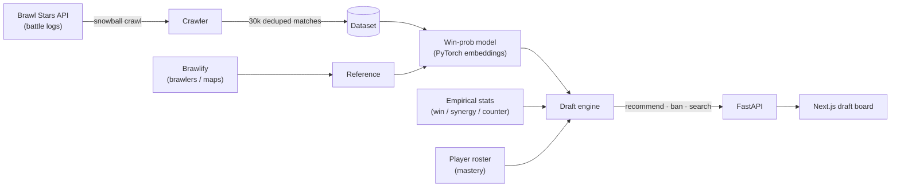

# ⚔️ Brawl Draft — AI Ranked Draft Assistant

An AI-powered draft assistant for **Brawl Stars Ranked**. It recommends bans and picks in
real time using a win-probability model trained on **30,000+ real ranked matches**, fused
with empirical map statistics — and goes well beyond the usual "win-rate + synergy + counter"
tools with a **seat-aware minimax lookahead**, **composition warnings**, and **per-player
roster mastery**.


> **Status:** feature-complete. Built as a practical drafting tool *and* an end-to-end ML
> portfolio project — data pipeline → trained model → search/optimization → product.

<!-- Add a screenshot of the running app to docs/screenshot.png, then restore:  -->
> 🎮 Map select → ban/pick → real-time, explainable recommendations. Run it locally via the [Quickstart](#quickstart).

---

## Why it's different

Most draft tools reduce a pick to `map win-rate + pairwise synergy + pairwise counters`.
This project keeps that as a *baseline* and adds layers that no single competitor combines:

| Layer | What it does |
| --- | --- |
| 🎯 **Win-probability model** | Learned brawler + map embeddings predict `P(win)` for any 3v3 vs 3v3 on any map. Calibrated (ECE 0.012). |
| 🔮 **Seat-aware search** | Minimax lookahead over the 1-2-2-1 snake — reasons about the enemy's best responses, and captures first-pick vs last-pick value. |
| ⚖️ **Composition warnings** | Flags comp holes: no frontline, no long range, double-tank, "enemy is tank-heavy — bring a Marksman," mode-specific advice. |
| 👤 **Roster mastery** | Personalizes to *your* account: restricts to owned brawlers and weights by power level, comfort (personal trophies), and build completeness — including **buffies**. |
| 🔍 **Explainability** | Every suggestion shows a transparent per-signal breakdown (map / synergy / counter / role / model / mastery) and a sample-size confidence. |

## Features

- **Ban + pick phases** with a clickable draft board (6 bans, 3v3, unique picks).
- **Live recommendations** that re-rank instantly as the draft fills in.
- **Map-aware**: 100+ maps across the 6 current ranked modes, with per-map stats.
- **Deep-search toggle** for the seat-aware lookahead; **Personalize toggle** for roster mastery.
- **Transparent scoring** — no black box; every number is shown.

## Architecture



## How it works

**1. Data.** The official API is player-centric, so a snowball crawler seeds top players from
the leaderboards, harvests the other 5 tags from every ranked match, and dedupes by a stable
match key (the same match appears in up to 6 players' logs). Result: 30k+ labeled
`(map, team A, team B) → winner` rows.

**2. Win-probability model.** A small PyTorch network with learned brawler, map, and mode
embeddings. The key design choice is an **antisymmetric** head:

```
logit = [ S(A, ctx) − S(B, ctx) ]      # context-conditioned team strength
      + [ PA·QB − PB·QA ]               # low-rank antisymmetric counter term
```

Swapping the two teams negates the logit, so `P(A wins) + P(B wins) = 1` *by construction* —
no team-order bias and no global offset to learn. The counter term captures specific matchups
(brawler X beats Y) that a pure strength model can't.

**3. Draft engine.** Given a draft state, it fuses the model with empirical map win-rates,
synergy, counters, role-fit, and (optionally) your mastery into a transparent score. The
**seat-aware search** runs a depth-limited, top-K-pruned, memoized minimax over the remaining
snake, evaluating completed drafts with the model — so it values picks by their projected
win-probability *after the enemy responds optimally*.

**4. App.** A FastAPI backend serves the engine; a Next.js board calls it and renders live,
explainable recommendations.

See [`docs/MODEL_CARD.md`](docs/MODEL_CARD.md) for the full methodology, training, and evaluation.

## Results

Held-out validation on ~30k matches (lower log-loss/ECE is better; higher AUC/accuracy is better):

| Model | Log-loss | Accuracy | AUC | ECE |
| --- | --- | --- | --- | --- |
| Always 0.5 | 0.6931 | 0.500 | – | – |
| Logistic regression (brawler presence) | 0.6879 | 0.541 | 0.557 | – |
| **Embedding net** | **0.6846** | **0.549** | **0.576** | **0.012** |

The embedding net beats both baselines and is **well-calibrated**. The absolute AUC is modest
*by nature of the problem*: at top ladder both teams draft competently and the outcome is
mostly decided by in-game skill, so the draft explains only a slice of the result. That's why
the tool ranks picks by *marginal* win-probability and fuses the model with lower-variance
empirical signals, rather than trusting any single number.

## Tech stack

- **ML / backend:** Python · PyTorch · scikit-learn · FastAPI
- **Data:** official Brawl Stars API (custom async crawler) + [Brawlify](https://brawlapi.com) for reference data & images; stored as JSONL/Parquet
- **Frontend:** Next.js · React · TypeScript · Tailwind CSS

## Project structure

```
backend/
  bsdraft/
    api/         FastAPI app (reference + recommend + roster)
    collect/     Async crawler: client, snowball, match parser, dedup
    data/        Reference loaders, encoders, dataset builder
    models/      PyTorch win-probability model + serving
    engine/      Stats, fused scoring, bans, seat-aware search, warnings, mastery
  scripts/       collect.py · train.py · smoke_test.py
frontend/        Next.js draft board
data/reference/  Brawlers, maps, modes, class overrides (committed)
docs/            Model card, methodology, charts
```

## Quickstart

```bash
# 1. Backend (Python 3.11+)
python3 -m venv .venv && source .venv/bin/activate
pip install -r backend/requirements.txt
cp .env.example .env          # add BRAWLSTARS_API_TOKEN + PLAYER_TAG

# 2. Collect data and train (one-time; needs an API key)
PYTHONPATH=backend python backend/scripts/collect.py --target 30000
PYTHONPATH=backend python backend/scripts/train.py

# 3. Run the app
PYTHONPATH=backend uvicorn bsdraft.api.main:app --port 8000     # backend
npm --prefix frontend install && npm --prefix frontend run dev  # → http://localhost:3000
```

> Get a free API key at [developer.brawlstars.com](https://developer.brawlstars.com). Keys are
> IP-locked — allow the public IP of the machine running the crawler.

## Deployment

- **Frontend** → Vercel (Next.js native). Set `NEXT_PUBLIC_API_BASE` to your backend URL.
- **Backend** → any Python host (Render / Railway / Fly.io). Mount the trained `winprob.pt`
  and the `data/reference/` files; set `BRAWLSTARS_API_TOKEN` + `PLAYER_TAG`. Note the API
  key's IP allow-list must include the host's egress IP.

## Roadmap

- [x] Data pipeline · win-prob model · draft engine · web app
- [x] Seat-aware search · composition warnings · roster mastery
- [ ] Best-of-3 series awareness · map-geometry features · continuous data refresh

## Credits

- Official Brawl Stars API — <https://developer.brawlstars.com>
- [Brawlify / BrawlAPI](https://brawlapi.com) for reference data & images
- Prior art / inspiration: [DraftStars](https://github.com/mcmckinley/DraftStars)

Not affiliated with, endorsed by, or sponsored by Supercell. *Brawl Stars* is a trademark of
Supercell Oy.

## License

[MIT](LICENSE) © 2026 Mitchell Tatge
